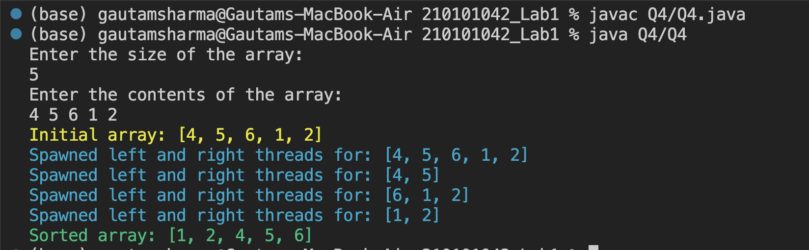

# CS331: Programming Languages Lab

## Lab-1

### Q4

#### Running the file

Run the following commands in the terminal of the root folder `210101042_Lab1`: 

```
javac Q4/Q4.java
java Q4/Q4
```

#### Input

One needs to enter the array in the following format:

```
Enter the size of the array in first line
Enter the contents of the array in second line
```

#### Output

The output consists of: 

1. The initial array.
2. The arrays for which the `left` and `right` threads were spawned.
3. The final sorted array.



Credits - [Gautam Sharma](https://g-s01.github.io/)