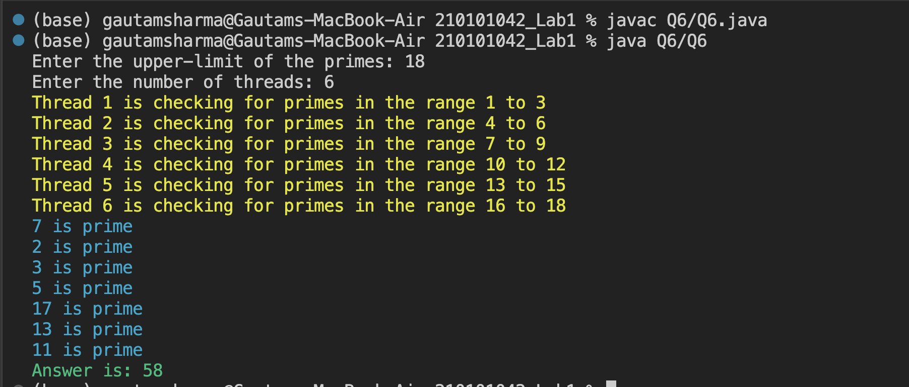

# CS331: Programming Languages Lab

## Lab-1

### Q6

Develop a Java program that employs multiple threads to calculate the sum of all prime numbers up to a specified limit. 

#### Running the file
Run the following commands in the terminal of the root folder `210101042_Lab1`: 

```
javac Q6/Q6.java
java Q6/Q6
```

#### Input

One needs to enter the array in the following format:

```
Enter the limit upto which the sum of primes is needed
Enter the number of threads to be used for processing
```

#### Output

The output consists of: 

1. The threads and their corresponding range of integers for checking.
2. The numbers which are prime and less than or equal to the limit.
3. Sum of the numbers which are prime and less than or equal to the limit.



Credits - [Gautam Sharma](https://g-s01.github.io/)
