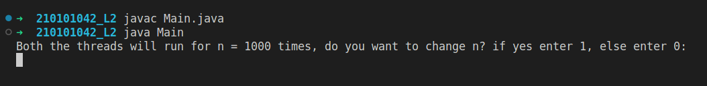
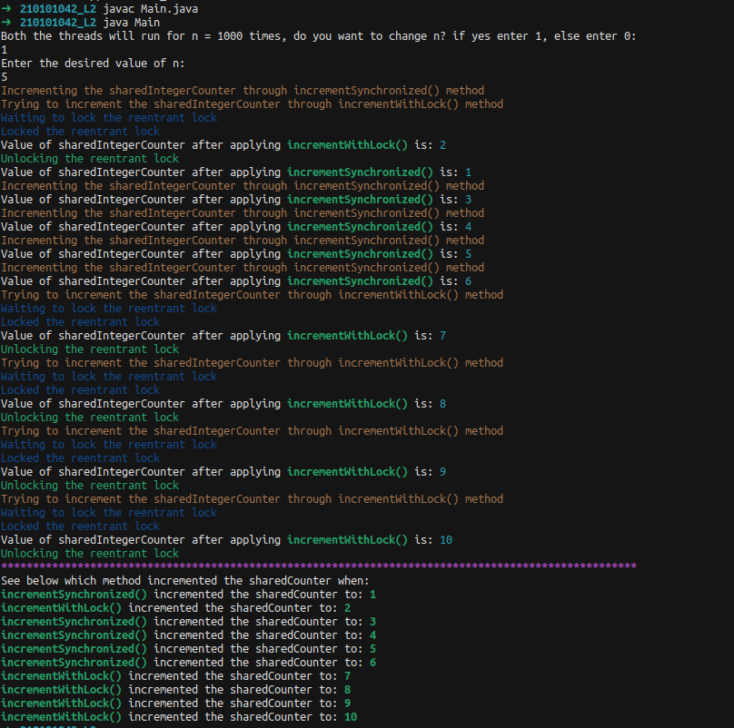
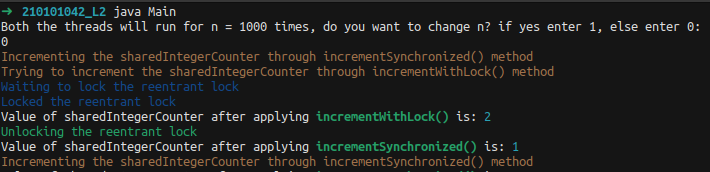
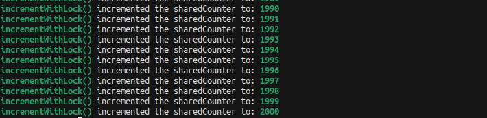

# CS331: Programming Languages Lab

## Lab-2

### Implementing a Shared Integer Counter

#### Task

Consider a scenario where multiple threads need to update a shared counter concurrently. Your task is to implement a Java program that simulates this situation using two different synchronization techniques: the synchronized keyword and ReentrantLock.
1. Create a class named SharedCounter with a shared integer counter and two methods: incrementSynchronized() and incrementWithLock(). The incrementSynchronized() method should use the synchronized keyword to ensure thread safety, and the incrementWithLock() method should use a ReentrantLock for synchronization.
2. Implement a CounterUpdater class that extends Thread and takes an instance of SharedCounter as a parameter in its constructor. The CounterUpdater class should have a run() method that increments the shared counter 1000 times.
3. In the main class, create an instance of SharedCounter and two instances of CounterUpdater, one for each synchronization technique.
4. Start both threads and wait for them to finish. Print the final value of the shared counter.

#### Running the file

Run the following commands in the terminal of the root folder: 

```
javac Main.java
java Main
```

#### Assumptions

* The `sharedIntegerCounter` is initialized to `0`, so the incrementing starts from `0`. 

#### Input

One needs to enter the an integer `changeN`
* If the person wants to change the number of times the threads try to increment the counter, then the person should enter `1`
* Else the person should enter 0, and both the threads run forn `n=1000` times

Enter `changeN` in the following format:

```
Enter changeN in first line
if changeN == 1, enter the new n in the second line
```



#### Output

The output consists of: 

1. The simulation of the `incrementWithLock()` method obtaining lock and incrementing `sharedIntegerCounter`.
2. The simulation of the `incrementSynchronized()` incrementing `sharedIntegerCounter`.
3. List of the `sharedIntegerCounter` values from `1` to `n` and the method which increment the `sharedIntegerCounter` to that particular value.



Figure-1: Output when `changeN` is `1`





Figure-2, 3: Output when `changeN` is `0` 

* Note

One can always change the code to take the initial value of the `sharedIntegerCounter` also as input :)

Credits - [Gautam Sharma](https://g-s01.github.io/)
