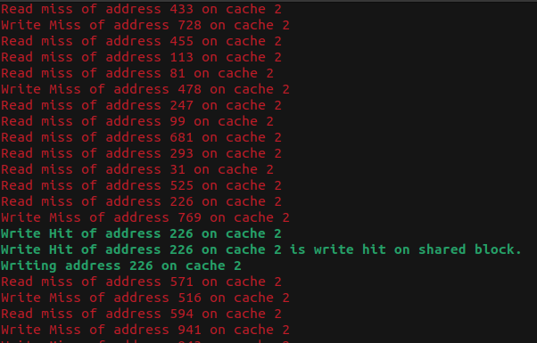
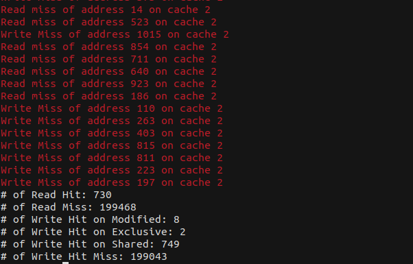

# CS331: Programming Languages Lab

## Lab-3

### Implementing [MESI](https://en.wikipedia.org/wiki/MESI_protocol) Cache Coherence Protocol

#### Task

Implement a cache coherence protocol for a shared-memory multi-processor thrashing system in Java, ensuring the consistency of data in memory for simultaneous read and write operations, there are 4 caches(threads) of different set associativity i.e. 1,2,4,8, and incorporating cache invalidation or snooping or write-update or write-back whichever has less overhead.

Here’s a high-level overview of what you need to do:

1. Understanding Cache Coherence Protocols: Cache coherence protocols ensure that changes in the values of shared operands (data) are propagated throughout the system in a timely fashion1. Common protocols include MSI (Modified, Shared, Invalid), MESI (Modified, Exclusive, Shared, Invalid), MOSI (Modified, Owned, Shared, Invalid), and MOESI (Modified, Owned, Exclusive, Shared, Invalid).

2. Implementing Multi-threading in Java: Each cache can be represented as a thread in Java. You’ll need to ensure proper synchronization to prevent race conditions and deadlocks.

3. Set Associativity: In a set-associative cache, each cache line could be placed in one of “N” slots in the cache. You’re asked to implement caches with different set associativities i.e., 1 (direct-mapped), 2, 4, and 8.

4. Handling Read/Write Operations: You need to ensure the consistency of data in memory for simultaneous read and write operations. This involves implementing mechanisms for cache invalidation, snooping, write-update, or write-back.

Remember, this is a complex task that requires careful design and testing. It’s important to break down the problem, tackle each part individually, and then integrate everything into a complete solution.

#### Running the file

Run the following commands in the terminal of the root folder `210101042_L3`: 

```
javac Main.java
java Main
```

#### Assumptions

* **No exclusive block replacement strategy is used on cache miss**
* All the threads try to read/write for `100000` times only

#### Input

No input is required, as the program is a simulation of cache coherence protocol.

#### Output

The output consists of: 

1. Simulation of Read Hit on various caches
2. Simulation of Read Miss on various caches
3. Simulation of Write Hit on Exclusive blocks on various caches
4. Simulation of Write Hit on Shared blocks on various caches
5. Simulation of Write Hit on Modified blocks on various caches
6. Simulation of Write Miss on various caches
7. Number of Read Hit on various caches
8. Number of Read Miss on various caches
9. Number of Write Hit on Exclusive blocks on various caches
10. Number of Write Hit on Shared blocks on various caches
11. Number of Write Hit on Modified blocks on various caches
12. Number of Write Miss on various caches



Fig. 1: Simulation of various hits and misses.


Fig. 2: Statistics of writes and hits.

# Note

The statistics are not good as no good block replacement strategy is being used.

Credits - [Gautam Sharma](https://g-s01.github.io/)